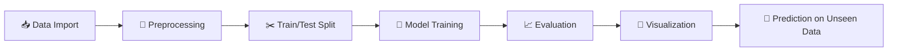

<div align="center">

# 🌍 Earthquake Data Analysis & Machine Learning

**An end-to-end Machine Learning workflow for earthquake magnitude prediction**

[](https://www.python.org/)
[](https://jupyter.org/)
[](https://scikit-learn.org/)
[](https://pandas.pydata.org/)
[](https://numpy.org/)

[](#-license)
[](#)
[](#)
[](#)


</div>

---

## 📖 Project Overview

This project demonstrates an **end-to-end Machine Learning workflow** applied to an earthquake dataset — from raw data to trained, evaluated, and visualized models.

<details>
<summary><strong>🔍 Click to expand: what the notebook covers</strong></summary>

- ✅ Data preprocessing
- ✅ Feature engineering
- ✅ Dataset export
- ✅ Train-test split
- ✅ Multiple Machine Learning models
- ✅ Model evaluation
- ✅ Data visualization
- ✅ Prediction on unseen data
- ✅ Feature importance analysis

</details>

**Goal:** Predict earthquake magnitude using geological parameters, and compare the effectiveness of different ML algorithms across both regression and classification tasks.

---

## 📂 Dataset

| Feature | Description |
|:--|:--|
| 🗓️ `Date` | Date of occurrence |
| ⏰ `Time` | Time (UTC) |
| 🧭 `Latitude` | Geographic latitude |
| 🧭 `Longitude` | Geographic longitude |
| 🕳️ `Depth` | Earthquake depth (km) |
| 📏 `Magnitude` | Earthquake magnitude |
| 🏷️ `Magnitude Type` | Scale used to measure magnitude |

> Columns are renamed during preprocessing for improved readability and consistency.

---

## 🛠️ Tech Stack

<div align="center">

| Category | Tools |
|:--|:--|
| **Language** |  |
| **Environment** |  |
| **Data Handling** |   |
| **Visualization** |   |
| **Machine Learning** |  |

</div>

---

## 📊 Project Workflow



### 1️⃣ Data Import
- Load earthquake dataset
- Inspect structure and data types

### 2️⃣ Data Preprocessing
- Rename columns for clarity
- Check missing values
- Verify datatypes
- Export processed dataset → `Earthquake_data_processed.xlsx`

### 3️⃣ Dataset Splitting
```python
from sklearn.model_selection import train_test_split
X_train, X_test, y_train, y_test = train_test_split(X, y, test_size=0.2, random_state=42)
```

---

## 🤖 Machine Learning Models

<details open>
<summary><strong>1. 📈 Multiple Linear Regression</strong></summary>

Used for continuous magnitude prediction.

- Train model → Predict on test data → Predict on new data → Evaluate

**Metrics:** R² Score · MSE · RMSE
**Visualization:** Actual vs Predicted Scatter Plot

</details>

<details>
<summary><strong>2. 🧮 Support Vector Regression (SVR)</strong></summary>

Applies Support Vector Machines to a regression setting.

- Train model → Predict on test set → Predict unseen samples → Compare

**Metrics:** MSE · R² Score
**Visualization:** Regression Plot

</details>

<details>
<summary><strong>3. 🏷️ Naive Bayes Classification</strong></summary>

Used to predict **Magnitude Type** (categorical) rather than numerical magnitude.

- Train classifier → Predict magnitude type → Calculate accuracy → Visualize

**Metric:** Classification Accuracy

</details>

<details>
<summary><strong>4. 🌳 Random Forest Regression</strong></summary>

Combines multiple decision trees for improved prediction accuracy.

- Train model → Predict test set → Evaluate → Visualize

**Metrics:** MSE · R² Score
**Extras:** Feature Importance · Residual Plot · Scatter Plot

</details>

---

## 📈 Visualizations

| Type | Purpose |
|:--|:--|
| 🔵 Scatter Plot | Compare predicted vs actual values |
| 📉 Regression Plot | Visualize model fit |
| 🎯 Actual vs Predicted | Assess prediction quality |
| ⭐ Feature Importance Graph | Identify influential features |
| 📊 Residual Plot | Analyze error distribution |

---

## 📁 Project Structure

```
Earthquake-ML/
│
├── EDA.ipynb                          # Main analysis & modeling notebook
├── Earthquake_data_processed.xlsx     # Cleaned/processed dataset
├── dataset.csv                        # Raw dataset
└── README.md                          # Project documentation
```

---

## 🚀 Getting Started

### Prerequisites


### 1. Clone the repository
```bash
git clone https://github.com/SiriNandinii/Earthquake-ML.git
cd Earthquake-ML
```

### 2. Install dependencies
```bash
pip install pandas numpy matplotlib seaborn scikit-learn jupyter
```

### 3. Launch the notebook
```bash
jupyter notebook
```

### 4. Open and run
```
EDA.ipynb  →  Run All Cells ▶️
```

---

## 📊 Model Evaluation Summary

| Model | Type | Key Metrics |
|:--|:--|:--|
| Multiple Linear Regression | Regression | R², MSE, RMSE |
| Support Vector Regression | Regression | MSE, R² |
| Naive Bayes | Classification | Accuracy |
| Random Forest Regression | Regression | MSE, R², Feature Importance |

---

## 🎯 Learning Outcomes

- 🧹 Data preprocessing & feature engineering
- 📉 Regression techniques
- 🏷️ Classification techniques
- ⚖️ Model comparison & performance evaluation
- 🎨 Visualization of predictions
- ⭐ Feature importance analysis

---

## 🔮 Future Improvements

- [ ] Hyperparameter tuning
- [ ] Cross-validation
- [ ] Gradient Boosting
- [ ] XGBoost
- [ ] LightGBM
- [ ] CatBoost
- [ ] Deep Learning models
- [ ] Time-series forecasting
- [ ] Earthquake risk prediction dashboard
- [ ] Deployment using Flask or Streamlit

---

## ⭐ Key Highlights

<div align="center">

| ✅ | Highlight |
|:--:|:--|
| 🧭 | Clean and structured workflow |
| 🤖 | Multiple Machine Learning algorithms |
| 🔀 | Regression + Classification combined |
| 📊 | Comprehensive evaluation metrics |
| 🎨 | Visualization-rich notebook |
| 🌱 | Beginner-friendly implementation |

</div>

---

## 👩‍💻 Author

<div align="center">

**Siri Nandini Alanka**

*AI & Machine Learning Student | Full Stack Developer | Machine Learning Enthusiast*

[](https://github.com/SiriNandinii)

</div>

---

## 📜 License


This project is intended for **educational and learning purposes**.

---

<div align="center">

### ⭐ If you found this project helpful, consider giving it a star!

</div>
